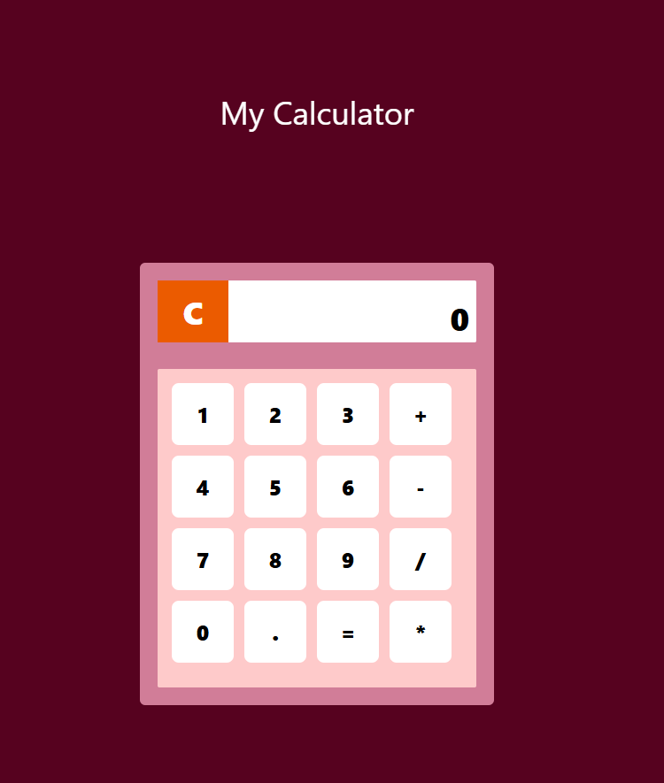

# Calculator Application

A simple and interactive calculator application built using HTML, CSS (Tailwind CSS), and JavaScript. This project demonstrates basic arithmetic operations (addition, subtraction, multiplication, and division) and provides a clean and modern user interface.

## Table of Contents

- [Project Overview](#project-overview)
- [Features](#features)
- [Tech Stack](#tech-stack)
- [Installation](#installation)
- [Usage](#usage)
- [Contributing](#contributing)
- [License](#license)

## Project Overview

This is a basic calculator application that allows users to perform basic arithmetic operations. The user interface is responsive and designed using Tailwind CSS for styling. The app uses JavaScript to handle the logic for the calculator's functionality.

## Features

- Perform basic arithmetic operations: Addition, Subtraction, Multiplication, and Division.
- Decimal support for more precision.
- Clean and responsive design using Tailwind CSS.
- Clear button (C) to reset the current calculation.
- Display panel to show the current input and result.

## Tech Stack

- **HTML**: Structure of the calculator app.
- **CSS**: Tailwind CSS for modern and responsive design.
- **JavaScript**: Handles the functionality of the calculator, including arithmetic operations and display logic.

## Screen Shots



## Installation

To get started with this project, follow these steps:

### Clone the repository

```bash
git clone https://github.com/iamprashu/Javascript_Projects.git
````
Navigate to the project folder

````bash
cd Calculator
````
- Open the index.html file in your browser

- Simply double-click on the index.html file or open it with your preferred browser to view the calculator.

### If You Want To Edit it:
- Open the Project folder and a terminal also.
- Nevigate to that folder using terminal.
- Make sure you have node.js installed.
- Use These Commands.
````bash
npm install 
````
- start editing it
- to run the tailwind(version 3.xx) css watcher use
````bash
npx tailwindcss -i Entry.css -o output.css --watch
````

### Usage
- Once the app is open in your browser, you can:

- Click the number buttons (0-9) to input values.

- Use the decimal button (.) for decimal values.

- Click on any of the operation buttons (+, -, *, /) to select the desired operation.
- Press the "=" button to get the result.
- Press the "C" button to clear the current input and reset the calculator.
### Contributing
Contributions are welcome! If you'd like to contribute to this project, please follow these steps:

- Fork the repository.
- Create a new branch (git checkout -b feature-name).
- Make your changes.
- Commit your changes (git commit -am 'Add new feature').
- Push to the branch (git push origin feature-name).
- Open a Pull Request.
### License
This project is licensed under the MIT License.