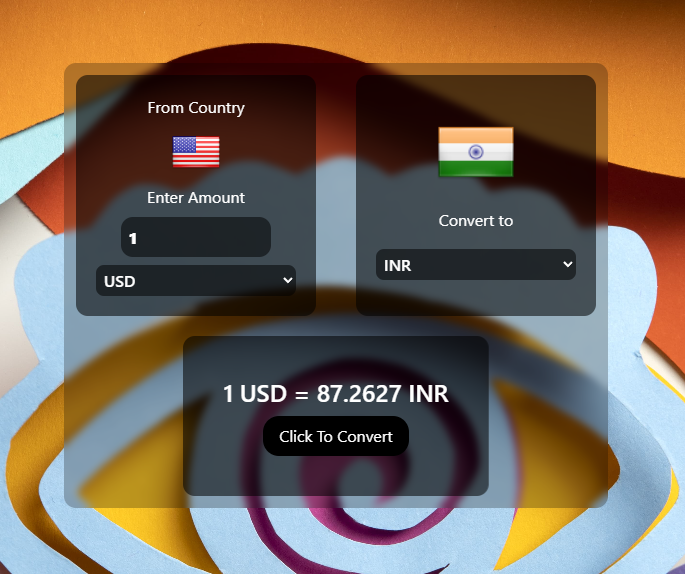

# 💰 Currency Converter Web App  

A simple yet powerful **Currency Converter** that fetches real-time exchange rates using the **ExchangeRate API**. Built with **JavaScript, Tailwind CSS, and asynchronous API handling**, this project provides an intuitive way to convert currencies dynamically.  

## 🚀 Features  
✅ **Live exchange rates** powered by the [ExchangeRate API](https://www.exchangerate-api.com/)  
✅ **Country flags** dynamically updated using the [Flags API](https://flagsapi.com/)  
✅ **Responsive UI** with **Tailwind CSS** for a sleek and modern look  
✅ **Asynchronous JavaScript** using `fetch()` and `async/await`  
✅ **Error handling** for invalid inputs and API failures  

## 📸 Screenshots  
  

## 🛠️ Technologies Used  
- **HTML, CSS (Tailwind CSS)**  
- **JavaScript (ES6+)**  
- **ExchangeRate API** (for real-time exchange rates)  
- **Flags API** (for country flags)  

## 🔧 Installation & Setup  

1️⃣ **Clone the repository:**  
```bash
git clone https://github.com/iamprashu/CurrencyConverter.git
cd currency-converter
```
  
2️⃣ **Open the project in a browser:**  
Just open `index.html` in your browser—no extra setup needed!  

## 🎯 How It Works  
1. **Select the "From" and "To" currencies** from the dropdown.  
2. **Enter the amount** you want to convert.  
3. **Click "Convert"** to get the latest exchange rate.  
4. The converted amount is displayed dynamically.  

## ⚡ Challenges & Learnings  
### **🔹 Challenges:**  
❌ Handling API rate limits on free-tier plans  
❌ Ensuring smooth dropdown updates when selecting currencies  
❌ Fixing broken flag URLs due to incorrect country codes  

### **💡 Learnings:**  
✅ **How to work with multiple APIs** efficiently  
✅ **Error handling in JavaScript** for smoother user experience  
✅ **Advanced DOM manipulation** for dynamic UI updates  
✅ **Tailwind CSS for rapid UI development**  

## 🌟 Contributing  
Want to improve this project? Feel free to fork and submit a PR! Contributions are always welcome.  

## 📜 License  
This project is open-source under the **MIT License**.  

---

### 🔗 **Connect With Me**  
💼 **LinkedIn:** [Click Me](https://linkedin.com/in/iamprashu)  
🐙 **GitHub:** [My GitHub](https://github.com/iamprashu)  
